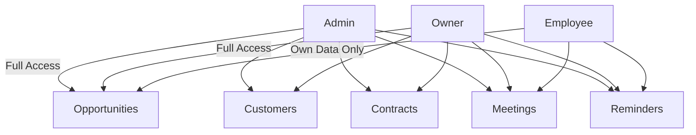
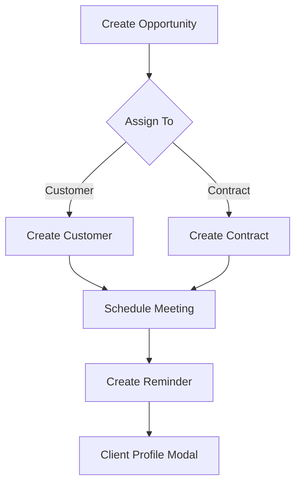

# Sreenidhi CRM Project Documentation
---

## 13. Code-Level Logic: Backend & Frontend

### Backend: server/index.js

- **Express App Setup**: Initializes Express, CORS, JSON parsing, and database pool.
- **Authentication & Authorization**: Uses JWT, middleware (`requireAuth`, `requireRole`) to protect endpoints and enforce role-based access.
- **User Resolution**: Functions to resolve users by email/username/full_name for assignment and audit logging.
- **Opportunities CRUD**:
	- Endpoints for listing, creating, updating, and deleting opportunities.
	- Handles assignment to CUSTOMER or CONTRACT, salesperson selection, and stage transitions.
	- Stage transitions (LEAD, QUALIFIED, NEGOTIATION, AGREED, DISAGREED, CANCELLED) require audit logging and, for certain transitions, a reason code and text.
	- When moving to AGREED, automatically creates or reactivates linked customers/contracts as needed.
	- When cancelling, cascades status to related customers/contracts.
- **Customers & Contracts CRUD**:
	- Endpoints for listing, creating, updating, and deleting customers/contracts.
	- Linked to opportunities via foreign keys.
	- Status management (ACTIVE, CANCELLED) with audit trail.
- **Meetings CRUD**:
	- Endpoints for listing, creating, updating, completing, cancelling, and deleting meetings.
	- Role-based scoping: Employees can only view/edit meetings they created or are assigned to; Owners/Admins can view/assign any.
	- Assignment logic ensures employees can only assign to themselves; Owners/Admins can assign to any selectable user.
	- Audit records for all status changes and edits.
- **Reminders CRUD**:
	- Endpoints for listing, creating, updating, marking as done/sent/failed, and deleting reminders.
	- Role-based scoping: Employees restricted to their own reminders or those linked to their meetings; Owners/Admins can view/assign any.
	- Assignment logic mirrors meetings.
 - **Reminders Audit (v2)**:
 	- Append-only table `reminders_audit_v2` stores JSON diff and snapshot per change with versioning and metadata.
 	- Actions covered: CREATE, UPDATE, STATUS. Hooks wired in POST/PUT/PATCH reminder routes.
 	- Read endpoints:
 		- `GET /api/reminders/:id/audit-v2` — per-reminder history with EMPLOYEE scoping.
 		- `GET /api/reminders-audit-v2` — global listing with filters: reminderId (pattern), action, date range; paginated; EMPLOYEE scoping.
 - **Reminders Email Selected Audit**:
 	- Single table `reminder_email_selected_audit` logs one row per reminder per email batch operation (operation_id).
 	- `POST /api/email/send` writes rows for selected reminders in both success and failure cases with recipients, sent_count, status, message_id, error, and meta.
 	- Read endpoints:
 		- `GET /api/reminders/:id/email-audit` — per-reminder send attempts.
 		- `GET /api/reminders-email-selected-audit` — global listing with filters: operationId, reminderId, status.
 - **Feature Flag**:
 	- `FEATURE_REMINDERS_AUDIT` gates the new audit features for safe rollout.
- **Expenses CRUD**:
	- Endpoints for listing, creating, updating, and deleting expenses linked to opportunities.
	- Audit records for all changes.
- **Client Profile Resolution**:
	- Unified endpoints to resolve Opportunity ID from Customer or Contract ID.
	- Aggregates all related data (opportunity, customer, contract, meetings, reminders) for frontend modal.
- **Dropdown Lookups**:
	- `/api/clients-lookup` and `/api/users-lookup` provide fast search for client and user selection in frontend comboboxes.
- **Employee Overview**:
	- Special endpoint for Owners/Admins to view an employee’s upcoming meetings and reminders.

### Frontend: React Components

- **Reminders.js**:
	- Manages tabs: My Overview, Employee Overview, Assigned To.
	- Fetches reminders and meetings for selected scopes (today, tomorrow, week, month).
	- Role-based UI: Employees see only their own; Owners/Admins can select any user.
	- Chips for assignment clarity (Assigned To, Assigned By).
	- Modals for create/edit actions, with permission checks.
	- History section for recent calls/emails, with filters and pagination.
	- Shows a "Sent: N" badge for EMAIL reminders using aggregated `emails_sent_attempts` from the list API.
	- Keyboard navigation and compact dropdowns for user selection.

- **Meetings.js**:
- **History.js**:
	- Adds two tabs:
		- "Reminders Audit (v2)" — global reminders change log with JSON diff and snapshot inspectors and filters (Reminder ID, Action, date range).
		- "Reminders Email Selected" — global per-reminder email attempts with filters (Operation ID, Reminder ID, Status) and details view for recipients/meta/error.
	- Uses token auth headers and enforces scoping via server.
	- Lists, creates, and edits meetings with full form.
	- Searchable combobox for assignee (Owner/Admin can select; Employee locked to self).
	- Filters by status, date, assignee, and search query.
	- Status transitions (Complete, Cancel, No-Show, Reschedule) require modal for reason input.
	- Table export and print options.

- **Opportunities.js**:
	- Lists, creates, and edits opportunities.
	- Assignment field (“CUSTOMER” or “CONTRACT”) determines downstream entity creation.
	- Stage transitions with modal for reason enforcement.
	- Expenses ledger for each opportunity, with add/edit/delete and audit trail.
	- Table export and print options.
	- Clicking Opportunity ID opens unified Client Profile modal.

- **Customer.js & Contracts.js**:
	- Lists, creates, and edits customers/contracts.
	- Autofill for Admins.
	- Table export and print options.
	- To be updated for clickable IDs to open Client Profile modal.

- **ClientProfileModal.js**:
	- Accepts Opportunity, Customer, or Contract ID.
	- Always displays resolved Opportunity ID.
	- Aggregates and displays all related details, meetings, reminders, assignment chips.
	- Role-based display of assignee/creator chips.

- **Common Patterns**:
	- All components use React hooks for state, effects, and memoization.
	- API calls use fetch with JWT token from localStorage.
	- Permission checks and UI gating are consistent across all components.
	- All tables support sorting, searching, and export/print.

### Data Flow & Security

- All API requests require authentication.
- Role-based middleware ensures correct data access.
- Frontend fetches only data allowed for the current user.
- Audit logs track all stage/status changes and assignments.
 - Reminders audits include both lifecycle changes and email send attempts; EMPLOYEE scoping mirrors Meetings visibility (creator/assignee or via linked meeting).

### Extensibility & Maintenance

- To add new roles, update backend middleware and frontend UI logic.
- To add new entities, follow the CRUD and role-based pattern.
- All assignment and audit logic is centralized for easy updates.
- Code is modular: each entity/component is self-contained and interacts via clear API contracts.

### Best Practices for Future Copilot Agents

- Always review role-based logic before editing or deleting code.
- Audit and assignment logic is critical for data integrity and compliance.
- UI permission checks must match backend enforcement.
- When adding new features, follow the established patterns for CRUD, assignment, and audit.
- Use the provided lookup endpoints for dropdowns and comboboxes.
- When in doubt, refer to this documentation and the code comments for guidance.

---

## 1. Project Overview
A full-stack CRM system for managing opportunities, customers, contracts, meetings, and reminders, with role-based access for Admin, Owner, and Employee users.

---

## 2. User Roles & Permissions

- **Admin**: Full access, can view and manage all data, assign tasks, and see all users’ activities.
- **Owner**: Similar to Admin, but focused on business operations. Can assign tasks, view all data, and manage employees.
- **Employee**: Limited to their own data. Can create, edit, and view only items they are assigned to or have created.

### Role Access Diagram

---

## 3. Backend (Node.js/Express)

### 3.1. Authentication & Authorization
- JWT-based authentication.
- Middleware: `requireAuth` (checks login), `requireRole` (checks user role).
- User info is attached to each request for scoping.

### 3.2. Core Endpoints

#### Opportunities
- CRUD endpoints for opportunities.
- Assignment field: “CUSTOMER” or “CONTRACT”.
- Stage transitions (LEAD, QUALIFIED, NEGOTIATION, AGREED, DISAGREED, CANCELLED) with audit logging and reason enforcement.

#### Customers & Contracts
- CRUD endpoints for customers and contracts.
- Linked to opportunities via foreign keys.
- Status management (ACTIVE, CANCELLED).

#### Meetings
- CRUD endpoints for meetings.
- Role-based scoping:
	- Admin/Owner: Can view and assign meetings to any selectable user.
	- Employee: Can only view/create/edit meetings they created or are assigned to.

#### Reminders
- CRUD endpoints for reminders (CALL, EMAIL, MEETING).
- Role-based scoping:
	- Admin/Owner: Can view and assign reminders to any selectable user.
	- Employee: Can only view/create/edit reminders they created or are assigned to.

#### Client Profile
- Unified endpoint to resolve Opportunity ID from Customer or Contract ID.
- Returns all related data: opportunity, customer, contract, meetings, reminders.

### 3.3. Role-Based Logic
- All endpoints check user role and ID for correct data access.
- Employees are restricted to their own items.
- Owners/Admins can access all data and assign tasks.

---

## 4. Frontend (React)

### 4.1. Main Components

#### Reminders.js
- Tabs: “My Overview”, “Employee Overview” (Admin/Owner only), “Assigned To”.
- Chips for “Assigned To” and “Assigned By”.
- Role-based actions: create, edit, delete.
- Searchable, compact dropdowns for user assignment.
- Keyboard navigation for comboboxes.

#### Meetings.js
- List, create, and edit meetings.
- Role-based assignment and visibility.
- Searchable combobox for assignee.
- Status transitions with modal for reason input.

#### Opportunities.js
- List, create, and edit opportunities.
- Assignment field (“CUSTOMER” or “CONTRACT”).
- Stage transitions with reason enforcement.
- Expenses ledger for each opportunity.

#### Customer.js & Contracts.js
- List, create, and edit customers/contracts.
- To be updated for clickable IDs to open unified profile modal.

#### ClientProfileModal.js
- Accepts Opportunity, Customer, or Contract ID.
- Always displays resolved Opportunity ID.
- Shows all related details, meetings, reminders, and assignment chips.

### 4.2. Role-Based UI Logic
- UI elements and actions are conditionally rendered based on user role.
- Employees see only their own data and can only assign to themselves.
- Owners/Admins see all data and can assign to any selectable user.

---

## 5. Workflow Example

### 5.1. Opportunity Creation
1. Owner/Admin/Employee creates an opportunity.
2. Assigns to “CUSTOMER” or “CONTRACT”.
3. Selects salesperson (Owner/Employee only).
4. Opportunity is saved and visible in the list.

### 5.2. Customer/Contract Creation
1. Linked to an opportunity.
2. Status managed (ACTIVE/CANCELLED).
3. Can be edited by Owner/Admin.

### 5.3. Meeting Scheduling
1. Owner/Admin can assign meetings to any user.
2. Employee can only assign to self.
3. Meetings are visible based on role and assignment.

### 5.4. Reminder Creation
1. Owner/Admin can assign reminders to any user.
2. Employee can only assign to self.
3. Reminders are visible based on role and assignment.

### 5.5. Client Profile Access
1. Clicking Opportunity, Customer, or Contract ID opens unified profile modal.
2. Modal shows all related data, always displaying resolved Opportunity ID.

---

## 6. Data Flow & Security

- All API requests require authentication.
- Role-based middleware ensures correct data access.
- Frontend fetches only data allowed for the current user.
- Audit logs track all stage/status changes and assignments.

---

## 7. UI Features

- Chips and tabs for assignment clarity.
- Searchable, compact dropdowns and comboboxes.
- Keyboard navigation for accessibility.
- Modals for create/edit actions and stage/status transitions.
- Export and print options for tables.

---

## 8. Extensibility

- Easily add new roles or permissions by updating backend middleware and frontend UI logic.
- New entities (e.g., tasks, notes) can follow the same CRUD and role-based pattern.

---

## 9. Usage Summary

- Admin: Full control, can manage all users and data.
- Owner: Business operations, can assign and view all.
- Employee: Limited to own data, can only assign to self.

---

## 10. Next Steps

- Update `Customer.js` and `Contracts.js` for clickable IDs to open unified profile modal.
- Final testing of modal from all entry points.
 - Evaluate reminders audit dashboards and export options.
 - Rollout plan: enable `FEATURE_REMINDERS_AUDIT`, run migrations, monitor logs; rollback by disabling the flag.

---

## 11. Example Workflow Diagram

---

## 12. References

- [Mermaid Diagrams](https://mermaid-js.github.io/)
- [VS Code Markdown PDF Extension](https://marketplace.visualstudio.com/items?itemName=yzane.markdown-pdf)
- [Pandoc](https://pandoc.org/)
